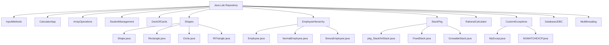

# 🧪 Programming with Java Lab – AIML 

Welcome to the official repository for the **Programming with Java Lab** course, part of the AIML specialization under Symbiosis International University.

This repository includes all the experiments implemented during the lab, demonstrating key OOPs concepts using Java, along with topics like interfaces, exception handling, multithreading, database connectivity, and more.

---

## 🎯 Course Objectives

- Understand and demonstrate the fundamentals of object-oriented programming in Java.
- Apply core concepts such as classes, objects, inheritance, polymorphism, interfaces, and packages.
- Handle exceptions and create user-defined exceptions.
- Perform basic database operations using JDBC.
- Explore multithreading and synchronization in Java.

---

## 🧵 Experiments List

| S.No | Topic Description |
|------|--------------------|
| 1 | Input Methods in Java (CLI, Scanner, BufferedReader, etc.) |
| 2 | Menu-driven Calculator using a separate `Calculator` class |
| 3 | Arrays, ArrayList conversion, and smallest distance finder |
| 4 | Student Management System using Array of Objects |
| 5 | Deck of Cards implementation |
| 6 | Abstract Class `Shape` and Dynamic Dispatch (Circle, Triangle, Rectangle) |
| 7 | Abstract `Employee` Class with subclasses `NormalEmployee` and `BonusEmployee` |
| 8 | Interface and Package-based Stack Implementation (`pkg_Stack`) |
| 9 | Rational Number Calculator with Exception Handling |
| 10 | Custom Exception `MyExcep` for factorial + `NOMATCHEXCP` |
| 11 | Java Database Connectivity (JDBC) |
| 12 | Multithreading using `Thread` class and its methods |

---

## 🗂️ Folder Structure (📈 Mermaid Diagram)



## 📚 Recommended Books

- *Java 2: The Complete Reference* – Herbert Schildt  
- *Programming With Java: A Primer* – E. Balagurusamy  
- *Java How to Program* – Deitel & Deitel  
- *Core Java: An Integrated Approach* – R. Nageswara Rao  

---

## 🧑‍🏫 Course Outcomes

After completing these experiments, students will be able to:

- Design and implement OOP concepts effectively in Java.  
- Work with Java collections, packages, interfaces, and abstract classes.  
- Create and handle custom exceptions.  
- Perform database operations and implement multithreading in real-world scenarios.  

---

## 🚀 How to Run

**Clone the repository:**

```bash
git clone https://github.com/yourusername/java-lab-experiments.git
cd java-lab-experiments


